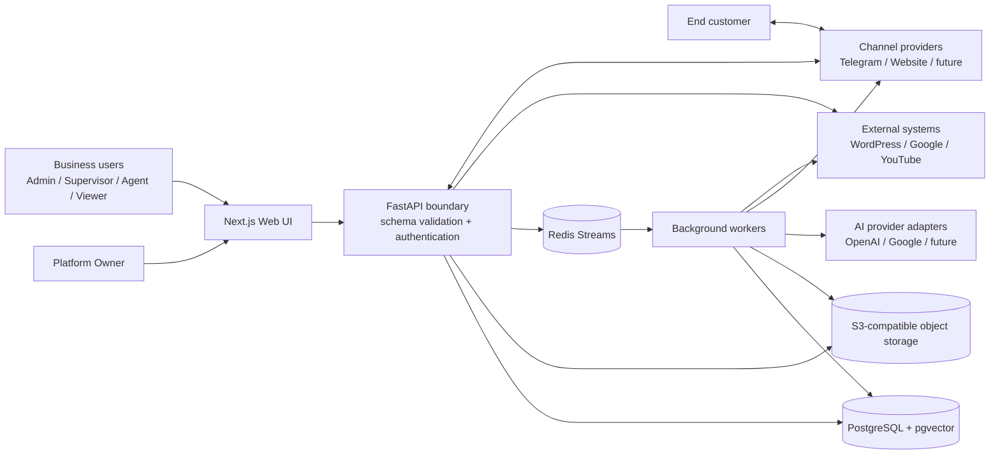
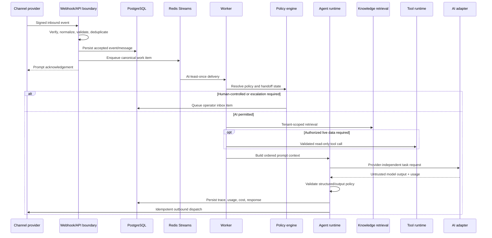
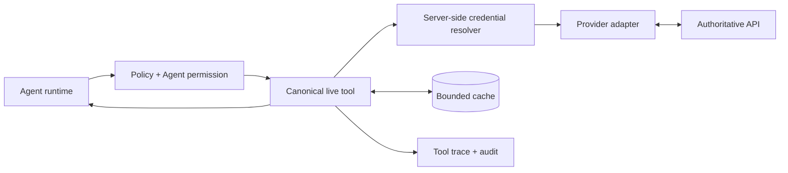

# Customers Manager HUB — Project Relationship Graph

Status: Architecture change-control baseline
Updated: 2026-09-10
Companion specification: `docs/specs/BUSINESS-OPERATING-MODEL-V1.md`

## 1. Purpose

This graph is the mandatory impact map for implementation planning and review. Before changing production behavior, the implementer must identify the affected nodes, inspect their incoming and outgoing edges, and list the tests required by the relevant impact rules in this document.

Legend:

- Solid node: capability already represented in the current architecture.
- Dashed node: planned capability defined by the approved V1 operating model.
- An arrow means the source may call, configure, supply, or depend on the target through an explicit contract.
- An arrow does not grant authorization. Tenant scope, RBAC, policy, and credential resolution remain server-side requirements.

## 2. System context graph

## 3. Domain dependency graph

```mermaid
flowchart TB
    subgraph Foundation[Foundation and authorization]
        tenant[Tenant / Business]
        identity[Platform user + membership]
        rbac[Roles and permissions]
        audit[Audit records]
        tenant --> identity --> rbac
    end

    subgraph Platform[Owner-only platform control]
        bizadmin[Business administration]
        aimodels[AI provider + model registry]
        taskroutes[Task model routing]
        pricing[Model pricing + Rial billing settings]
        wallet[Business wallets + ledger]
        assistantcfg[Configuration Assistant<br/>prompt + guardrails + limits]
        aimodels --> taskroutes
        aimodels --> pricing
        pricing --> wallet
        taskroutes --> assistantcfg
    end

    subgraph Setup[Business setup]
        profile[Business Profile]
        readiness[Setup Readiness]
        profile --> readiness
    end

    subgraph AgentDomain[Agent configuration]
        agent[Agent]
        agentprofile[Structured Agent behavior]
        prompt[Prompt + published versions]
        assignment[Agent-channel assignment]
        agent --> agentprofile
        agent --> prompt
        agent --> assignment
    end

    subgraph Integrations[Connections and adapters]
        connection[Managed Connection]
        credential[Encrypted credential binding]
        channel[Channel account + capabilities]
        connector[Channel adapter]
        syncadapter[Knowledge sync adapter]
        tooladapter[Live tool adapter]
        connection --> credential
        connection --> channel --> connector
        connection --> syncadapter
        connection --> tooladapter
    end

    subgraph KnowledgeDomain[Knowledge and RAG]
        kb[Knowledge base]
        source[Knowledge source]
        docversion[Document/source version]
        chunks[Chunks + provenance]
        vectors[Embeddings / pgvector]
        storage[Original objects / S3]
        kb --> source --> docversion
        docversion --> storage
        docversion --> chunks --> vectors
        syncadapter --> source
    end

    subgraph CustomerDomain[Customer interaction]
        contact[Contact]
        extidentity[External identity]
        conversation[Conversation]
        message[Message]
        memory[Structured customer memory]
        contact --> extidentity
        contact --> conversation --> message
        contact --> memory
    end

    subgraph Control[Deterministic control]
        policy[Rules and Controls]
        handoff[Human handoff state]
        inbox[Operator inbox]
        approval[Tool approval]
        policy --> handoff --> inbox
        policy --> approval
    end

    subgraph Runtime[AI and tool runtime]
        normalize[Canonical message normalization]
        queue[Idempotent processing queue]
        runtime[Agent runtime / prompt stack]
        retrieval[Tenant-scoped retrieval]
        tools[Tool runtime]
        trace[AI execution trace]
        usage[Usage + cost record]
        dispatch[Outbound dispatch]
        normalize --> queue --> runtime --> dispatch
        retrieval --> runtime
        tools --> runtime
        runtime --> trace --> usage
    end

    subgraph Experience[Business experience]
        setupui[Setup Center]
        operations[Contacts / Conversations / Inbox]
        analytics[Analytics + knowledge gaps]
        helper[Guided Configuration Assistant]
        setupui --> readiness
        operations --> analytics
        helper --> profile
        helper --> agentprofile
        helper --> prompt
    end

    tenant --> bizadmin
    tenant --> profile
    tenant --> connection
    tenant --> kb
    tenant --> agent
    tenant --> contact
    tenant --> policy
    tenant --> wallet
    rbac --> bizadmin
    rbac --> profile
    rbac --> connection
    rbac --> kb
    rbac --> agent
    rbac --> operations
    rbac --> policy

    profile --> agentprofile
    profile --> prompt
    kb --> readiness
    agent --> readiness
    channel --> readiness
    policy --> readiness

    connector --> normalize
    assignment --> runtime
    prompt --> runtime
    profile --> runtime
    policy --> runtime
    conversation --> runtime
    memory --> runtime
    vectors --> retrieval
    credential --> connector
    credential --> syncadapter
    credential --> tooladapter
    tooladapter --> tools
    approval --> tools
    runtime --> handoff
    dispatch --> connector
    runtime --> message
    usage --> wallet
    usage --> analytics
    trace --> analytics
    assistantcfg --> helper
    helper --> usage

    bizadmin --> audit
    profile --> audit
    connection --> audit
    prompt --> audit
    policy --> audit
    approval --> audit
    wallet --> audit

    classDef planned stroke-dasharray: 6 4,stroke-width:2px;
    class profile,readiness,agentprofile,connection,syncadapter,assistantcfg,setupui,helper planned;
```

## 4. Message-processing graph

## 5. Knowledge-processing graph

```mermaid
flowchart LR
    upload[Upload<br/>PDF / XLSX / DOCX]
    sync[Approved synchronized source<br/>WordPress / Drive / Sheets / YouTube]
    validate[Authorization + type + size + safety + tenant validation]
    original[(Versioned original object)]
    job[Idempotent ingestion job]
    extract[Format-aware extraction]
    normalize[Normalization + metadata preservation]
    chunk[Chunking + source provenance]
    embed[knowledge_embedding task route]
    pending[(Pending chunks + vectors)]
    verify[Count/hash/quality validation]
    active[(Atomic active version)]
    retrieve[Tenant-scoped retrieval]
    runtime[Agent runtime]

    upload --> validate
    sync --> validate
    validate --> original --> job --> extract --> normalize --> chunk --> embed --> pending --> verify --> active --> retrieve --> runtime
    verify -. failure keeps previous version active .-> active
```

## 6. Live-data graph

Live-data cache policy is selected by a Business Admin: no cache, 15 minutes, 1 hour, 1 day, or a bounded custom duration. End customers are not asked to choose cache behavior during a conversation.

## 7. Allowed dependency direction

The modular monolith follows these rules:

1. HTTP routes depend on application services and schemas, not ORM internals from unrelated modules.
2. Application services depend on domain contracts and repositories.
3. Provider/channel/source SDK logic remains behind adapters.
4. Agent runtime consumes canonical messages, retrieval contracts, tool contracts, policy decisions, and provider-independent AI requests.
5. Knowledge, tools, and channels do not contain Agent decision logic.
6. Analytics consumes events/traces; operational modules do not depend on dashboard presentation.
7. Billing consumes validated usage records; provider adapters do not mutate wallets directly.
8. Frontend visibility is usability only; authorization remains in the API.

## 8. Forbidden edges

The following relationships must fail review:

- Browser → raw credentials or provider secrets.
- Client-supplied `tenant_id` → authorization decision.
- AI model output → direct privileged action.
- Channel adapter → Agent/business decision logic.
- Provider SDK payload → core Business domain.
- Knowledge retrieval → cross-tenant chunks.
- Live price/inventory/order truth → RAG-only storage.
- Agent prompt → credential material.
- AI runtime → direct wallet mutation without a validated usage ledger operation.
- Human-controlled conversation → autonomous outbound AI response unless an explicit assist-only policy permits it.
- Configuration Assistant → automatic publication of prompts, policies, Agents, or connections.

## 9. Change-impact control matrix

| Changed node | Required dependency review | Minimum validation |
|---|---|---|
| Tenant, membership, RBAC | Every tenant-owned API and privileged Owner operation | Denied-role and cross-tenant negative tests |
| Business Profile | readiness, Agent context, assistant drafts, audit | schema, RBAC, tenant isolation, version/update tests |
| Agent or prompt | assignments, runtime stack, traces, publish/rollback | lifecycle, authorization, traceability, regression tests |
| Connection or credential | adapters, sources, tools, channels, audit | encryption/redaction, revoke/reconnect, SSRF, cross-tenant denial |
| Channel connector | webhook, normalization, idempotency, dispatch | signature/secret, duplicate inbound, retry-safe outbound contract tests |
| Knowledge ingestion | object storage, queue, parser, embedding, pgvector, activation | unsafe/invalid file, retry, provenance, tenant isolation, failed replacement rollback |
| Retrieval | runtime, citations, token use | tenant filter, relevance/empty result, provenance tests |
| Live tool | credential, policy, cache, schema, rate limit, audit | host allowlist, timeout, cache, denial, output validation tests |
| Rules and Controls | runtime, tools, handoff, channels | deterministic allow/deny and human-control negative tests |
| AI routing/model | runtime, assistant, embedding, usage/cost | adapter contract, fallback, timeout/retry, mocked usage tests |
| Pricing or wallet | usage ledger, Owner controls, Business display | atomicity, idempotency, insufficient balance, Rial conversion tests |
| Inbox/handoff | conversation state, dispatch, assignments | claim race, authorization, AI suppression, resolve/return tests |
| UI navigation/form | route guard, API authorization, RTL/LTR, empty/error states | role smoke tests, accessibility, lint, typecheck, production build |

## 10. Mandatory pre-implementation declaration

Every coding instruction must include:

1. Target graph node(s).
2. Direct upstream and downstream dependencies from this graph.
3. Explicit scope and out-of-scope behavior.
4. Data/migration impact.
5. Security and tenant-isolation impact.
6. Required tests from the impact matrix.
7. Rollback or failure behavior.

Every review must reject the change when an affected edge was ignored, a forbidden edge was introduced, or the stated tests do not cover the impacted path.

## 11. First instruction impact map

Package 0 affects only:

`SQLAlchemy metadata ↔ Alembic migration 0013 ↔ disposable PostgreSQL validation`

It must not change product behavior, API contracts, persisted production data, or the domain graph. The required result is a zero-drift migration baseline before any feature package begins.
